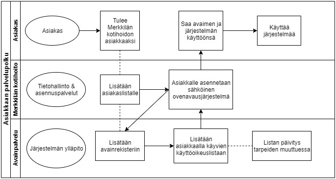

# Sähköinen ovenvausjärjestelmä - Palvelun vaatimusmäärittely

* TA-2020-2
* N4378
* Dokumentin versionumero 0.9 - 11.2.2020
* Vaatimusmäärittely pohjan versio 1.9 - 12.12.2019 (NarsuMan)

## Sisällysluettelo 

1. [Johdanto](#johdanto)
1. [Toimeksiantaja](#toimeksiantaja)
1. [Vaatimusmäärittelyn tekijästä](#vaatimusmaarittelyn_tekijasta)
1. [Palvelukuvaus](#palvelukuvaus)
1. [Sidosryhmäkartta](#sidosryhmakartta) 
1. [Sidosryhmät ja profiilit](#sidosryhmat_ja_profiilit)
1. [Tunnistetut riskit](#tunnistetut_riskit)
1. [Valitut asiakastarinat](#valitut_asiakastarinat) 
1. [Palveluun liittyviä asiakaspolkuja](#palveluun_liittyviä_asiakaspolkuja)
1. [Oleelliset käyttötapaukset](#oleelliset_kayttotapaukset) 
1. [Tärkeimmät yleiset ominaisuudet/toiminnallisuudet](#tarkeimmat_ominaisuudet/toiminnallisuudet) 
1. [MockUp-prototyyppi](#mockup-prototyyppi)
1. [Alustavat Käyttäjätarinat](#alustavat_käyttäjätarinat)
1. [Palvelun järjestelmävaatimukset](#palvelun_jarjestelmavaatimukset)
1. [Palveluun vaikuttavat rajaukset](#palveluun_vaikuttavat_rajaukset)
1. [Palvelun liityvät laitevaatimukset](#palvelun_liityvät_laitevaatimukset)
1. [Palvelun suoritusympäristöön liittyvät vaatimukset](#palvelun_suoritusymparistoon_liittyvät_vaatimukset) 
1. [Palvelun määritellyt ominaisuudet/toiminnnallisuudet](#palvelun_maaritellyt_ominaisuudet/toiminnnallisuudet) 
1. [Palvelun toiminnalliset vaatimukset](#palvelun_toiminnalliset_vaatimukset) 
1. [Palvelun ei-toiminnalliset vaatimukset](#palvelun_ei_toiminnalliset_vaatimukset) 
1. [Palvelun alustava arkkitehtuuri](#palvelun_alustava_arkkitehtuuri)
1. [Palvelun alustava sijoittelunäkymä](#palvelun_alustava_sijoittelunäkymä) 
1. [Palvelun alustava tietokantakuvaus)](#palvelun_alustava_tietokantakuvaus)
1. [Palvelun integraatiot muihin järjestelmiin](#palvelun_integraatiot_muihin_järjestelmiin) 
1. [Palvelun laadun varmistuksesta](#palvelun_laadun_varmistus)
1. [Palvelun hyväksyntätestit](#palvelun_hyväksyntatestit) 
1. [Julkaisusuunnitelma](#julkaisusuunnitelma)
1. [Aiheeseen liityvä standardit ja lähteet](#standardit_ja_lähteet)


## Johdanto

Hankinnan kohteena on sähköinen ovenavausjärjestelmä erilaisiin ovenavaustarpeisiin kunnissa. 
Ensivaiheessa järjestelmää tullaan käyttämään kuntien kotihoidon palvelutarpeisiin, ja sopimuskauden aikana järjestelmää voidaan käyttää myös muilla 
toimialoilla oleviin erilaisiin ovenavaustarpeisiin. Sähköinen ovenavausjärjestelmä täydentää mm. Tarmo Mobiili kotihoito –palvelukokonaisuutta. 

Palvelukokonaisuuden ensimmäisenä osana on syksyllä 2018 kilpailutettu mobiili kotihoidon toiminnanohjausjärjestelmä, jonka toimittajaksi valittiin Yritys Oy. 
Toiminnanohjausjärjestelmä ja sähköinen ovenavaus –järjestelmä integroidaan toisiinsa. Palvelun tulee kattaa mm. seuraavat: Hankinta käsittää ovenavaukseen 
tarvittavat lukkomoduulit, RFID/NFC-tagit ja -tarrat, ovenavauslupien hallintajärjestelmän (lähtökohtaisesti pilvipalveluna), käyttöönottoprojektiin tarvittavat 
palvelut sekä mahdollisesti tarvittavat hallintajärjestelmän jatkokehitystyöt.

## Toimeksiantaja

KunnanIntra Oy <br>
Y-Tunnus 123412-1 <br>
Postiosoite: Esimerkkitie 1 <br>
Postinumero: 40404 <br>
Postitoimipaikka: Merkkilä <br>
Maa: Suomi <br>
Verkko-osoite: http://kunnaninfra.testi.fi


## Vaatimusmäärittelyn tekijastä

Vaatimusmäärittelyn tekijä Tarmo, on palvelunsuunnittelijana Lukko & Softa Oy yrityksessä.
Tarmo on ollut osana yrityksen suurimpia projekteja, palveluiden sekä tuotteiden kehityksessä Senior Developer-roolissa Lukko & Softa Oy:n toiminnassa.
Yrityksellä on laaja kokemus ohjelmistojen kehityksestä ja erilaisten sähköisten lukkojen kehitystyöstä sekä toteutuksesta.

## Palvelukuvaus

Palvelun tarkoituksena on tuottaa sähköinen ovenavausjärjestelmä eri tarpeisiin Merkkilän kunnassa. Ensisijaisesti järjestelmä otetaan käyttöön
osana Merkkilän kunnan kotihoidon palveluja sekä käytännön järjestelyjä. 
Myöhemmässä vaiheessa järjestelmää tullaan käyttämään myös kunnan julkisten rakennusten ovien avauksiin sekä kulunvalvontaan. Käyttäjänä palvelussa ovat kunnan työntekijät, huoltoryhmät sekä sidosryhmät.

Palvelun tavoitteena on palvelun alkuvaiheessa vähentää kotihoidon työntekijöiden asiakasavaimiin liittyviä haasteita, kuten avainten keräilyä,
avainten vaihtoa työntekijältä toiselle ja ehkäistä avainten katoamistapauksia sekä näistä aiheutuvia kustannuksia ja kuluvaa työaikaa.
Palvelusta hyötyvät ensisijaisesti kunta, sen työntekijät sekä kunnan palveluiden asiakkaat.


## Sidosryhmäkartta


## Sidosryhmät ja profiilit 

| Sidosryhmä | Profiili | Lisätietoa |
|:-:|:-:|:-:|
| [Asiakkaat](profiilit/profiilikuvaus-asiakkaat.md) |[Asiakas profiili 1](profiilit/profiilikuvaus-asiakas1.md) | Edustaa 50 % asiakkaista |
| [Asiakkaat](profiilit/profiilikuvaus-asiakkaat.md)|[Asiakas profiili 2](profiilit/profiilikuvaus-asiakas2.md) | Edustaa 15 % asiakaskunnasta |
| [Asiakkaat](profiilit/profiilikuvaus-asiakkaat.md)|[Asiakas profiili 3](profiilit/profiilikuvaus-asiakas3.md) | Edustaa 35 % asiakaskunnasta |
| [Käyttäjät](profiilit/profiilikuvaus-kayttaja1.md) |[Työntekijät](profiilit/profiilikuvaus-asiakkaat.md) | Edustaa  kotihoidon työntekijää |
| [Käyttäjät](profiilit/profiilikuvaus-kayttaja-huolto.md) | [Huoltotyöntekijät](profiilit/profiilikuvaus-asiakkaat.md)  | Edustaa huoltopalvelun työntekijää |
| [Käyttäjät](profiilit/profiilikuvaus-kayttaja-turva.md) | [Turvapalvelut](profiilit/profiilikuvaus-asiakkaat.md) | Edustaa turvapalvelun työntekijää |

## Asiakkaan tarpeet/toiveet?

| VaatimusID | Tyyppi | Kuvaus | 								
|:-:|:-:|:-:|
| CUSTOMER-REQ-0001 | Customer Requirement | Käyttäjänä haluan oven avauksen tapahtuvan vaivattomasti | 
| CUSTOMER-REQ-0002 | Customer Requirement | Käyttäjänä haluan ettei minun tarvitse päivittää ovenavaus-oikeuksia jatkuvasti |
| CUSTOMER-REQ-0003 | Customer Requirement | Käyttäjänä haluan että järjestelmän käyttö on helpompaa kuin tavallisen avaimen käyttö |
| CUSTOMER-REQ-0004 | Customer Requirement | Käyttäjänä haluan että voin lisätä avainoikeuksia niitä tarvittaessa
| CUSTOMER-REQ-0005 | Customer Requirement | Käyttäjänä haluan että voin tarkastella oikeuksiani
| CUSTOMER-REQ-0006 | Customer Requirement | Ylläpitäjänä haluan että voin hallinnoida oikeuksia käyttöliittymästä |
| CUSTOMER-REQ-0007 | Customer Requirement | Ylläpitäjänä haluan että oikeuksien hallinnointi onnistuu suurelle käyttäjäryhmälle |
| CUSTOMER-REQ-0008 | Customer Requirement | Ylläpitäjänä haluan että voin muokata ja lisätä käyttäjiä ja avaimia |
| CUSTOMER-REQ-0009 | Customer Requirement | Ylläpitäjänä haluan että voin liittää avaimia järjestelmään |

## Liiketoiminnan vaatimukset/tavoitteet?

| VaatimusID | Tyyppi | Kuvaus | 
|:-:|:-:|:-:|
| BUSINESS-REQ-0001 | Business Requirement | Palvelun käytön tulee nopeuttaa avainten käsittellyyn kuluvaa aikaa | 
| BUSINESS-REQ-0002 | Business Requirement | Palvelun käytössä tulee huomioida käyttäjän teknisten taitojen vähäisyys |
| BUSINESS-REQ-0003 | Business Requirement | Palvelun tulee olla helposti hallinnoitavissa |
| BUSINESS-REQ-0004 | Business Requirement | Palvelun tulee olla skaalautuva jatkokehitystä varten |
| BUSINESS-REQ-0005 | Business Requirement | Palvelun tulee tuottaa seurantadataa jota voi hyödyntää työtehtävien suunnittelussa |


## Tunnistetut riskit

**SWOT Analyysi palvelusta**<br>

**Strengths:**<br>
Helppokäyttöinen käyttäjälle<br>
Yksinkertainen käyttää<br>
Monipuolinen järjestelmä<br>
Laajennettavuus<br>
Sovellettavuus<br>
Valvottavuus

**Weaknessess**<br>
Käyttäjäkokemuksen puute<br>
Oikeuksien hallinta tapahtuu muualla kuin käyttäjällä


**Opportunities:**<br>
Nopeuttaa yksikön toimintaa<br>
Helpottaa avainten käsittelyä<br>
Tuottaa tulosta vähentyneessä työajassa<br>
Lisää turvallisuutta kulunvalvonnalla

**Threats:**<br>
Väärinkäyttö<br>
Tietoturvan haasteet<br>
Tietojärjestelmävika<br>
Varkaudet<br>
Avaimen katoaminen<br>
Järjestelmän hidas käyttöönotto<br>
Perinteiseen avaimeen liittyvät edut


## Valitut asiakastarinat


**Asiakastarina 1**
[Asiakas-tyyppi-1](profiilit/profiilikuvaus-asiakas1) herää aamulla, kun kotihoito tulee käynnille. Hän tietää että hoitaja pääsee ovesta helposti sisään käyttäessään uutta ovijärjestelmää, eikä hänen tarvitse murehtia kuuliko nyt varmasti ovikellon soivan. Päivällä hänen luonaan käy ruokapalvelu tuomassa lämpimän ruoan. Hänen ei tarvitse miettiä voiko ottaa päiväunia, jos vaikka ruoka- tai kauppapalvelu tuo hänelle jotain, vaan voi luottaa että he pääsevät omilla avaimillaan sisälle. <br>

**Asiakastarina 2**
[Käyttäjä](profiilit/profiilikuvaus-kayttaja1) tulee töihin iltavuoroon ja tarkistaa illan asiakaslistansa läpi. Hän säästää työaikaa ja vaivaa koska hänen ei tarvitse kerätä jokaiselle asiakkaalle omaa avainta avainkaapista. Hän pääsee vaivatta jokaisen asiakkaan luo samalla tunnisteella. 
Tauolla hänen ei tarvitse huolehtia avainten vaihdosta tai odottaa puuttuvia avaimia toiselta työntekijältä. Hän pääsee jatkamaan töitään syötyään. Illan päätteeksi työntekijä jättää avaimensa toimistolle kaappiin ja voi keskittyä kirjaamaan käynneistä, ilman että hänen tarvitsisi laittaa avaimia takaisin.<br>

**Asiakastarina 3**
[Ylläpitäjä](profiilit/profiilikuvaus-yllapitaja) on töissä aamuvuorossa kunnan tietohallinnossa. Ylläpitäjä saa puhelun uudesta asiakkuudesta, ja myöhemmin turva-sähköpostilla hänen tietonsa. Ylläpitäjä lisää uuden asiakkuuden avainjärjestelmän käyttöliittymän kautta. Seuraavaksi hän lisää oveen avausoikeudet, pääasiassa kotihoidon käyttäjät, sekä muut palveluiden tuottajat asiakkaan palvelutarpeen mukaan. 


## Palveluun liittyviä asiakaspolkuja

Palvelun loppu-asiakkaan palvelupolku:


Palvelun käyttäjän palvelupolku:


## Oleelliset käyttötapaukset

Admin-ylläpitäjän yleisavaimien ylläpitotyökalu käyttäen käyttöliittymää:
```plantuml

rectangle Admin_User_management {
Admin--(Add user)
Admin--(Edit user)
Admin--(Edit user rights)
Admin--(Remove user)
}
```
Admin ylläpitäjän avaimien hallinnointityökalu, käyttäen käyttöliittymää:
```plantuml
rectangle Admin_Key_management {
Admin--(Add new key)
Admin--(Edit key)
Admin--(Delete key)
Admin--(Add key rights)
Admin--(Edit key rights)
Admin--(Remove key)
}
```
Avaimen käyttäjän käyttöliittymän vaihtoehdot:
```plantuml

rectangle Basic_user_interface{
User--(Show my keys)
User--(Edit key rights)
User--(Edit my info)
}
```


| Käyttötapaus | Osa-alue | toiminnallisuus/ominaisuus johon UC -liittyy |
|:-:|:-:|:-:|
| [Käyttötapaus 1 - Avaimen lisäys](use-case/kayttotapaus-addkey.md) | Avainten hallinta | [Avaintenhallinta-paneeli](ominaisuudet/prop-keymanager.md) | 
| [Käyttötapaus 2 - Avaimen muokkaus](use-case/kayttotapaus-editkey.md) | Avainten hallinta | [Avaintenhallinta-paneeli](ominaisuudet/prop-keymanager.md) | 
| [Käyttötapaus 3 - Avaimen poisto](use-case/kayttotapaus-deletekey.md) | Avainten hallinta | [Avaintenhallinta-paneeli](ominaisuudet/prop-keymanager.md) |
| [Käyttötapaus 4 - Näytä kaikki avaimet](use-case/kayttotapaus-showallkeys.md) | Avainten hallinta | [Avaintenhallinta-paneeli](ominaisuudet/prop-keymanager.md) |
| [Käyttötapaus 5 - Näytä kaikki käyttäjät](use-case/kayttotapaus-showallusers.md) | Käyttäjien hallinta | [Käyttäjähallinta-paneeli](ominaisuudet/prop-usermanager.md) |
| [Käyttötapaus 6 - Näytä avaimeni](use-case/kayttotapaus-showmykeys.md) | Avainten hallinta | [Avaintenhallinta-paneeli](ominaisuudet/prop-keymanager.md) |
| [Käyttötapaus 7 - Käyttäjän lisäys](use-case/kayttotapaus-adduser.md) | Käyttäjien hallinta | [Käyttäjähallinta-paneeli](ominaisuudet/prop-usermanager.md) |
| [Käyttötapaus 8 - Käyttäjän muokkaus](use-case/kayttotapaus-edituser.md) | Käyttäjien hallinta | [Käyttäjähallinta-paneeli](ominaisuudet/prop-usermanager.md) |
| [Käyttötapaus 9 - Käyttäjän poisto](use-case/kayttotapaus-deleteuser.md) | Käyttäjien hallinta | [Käyttäjähallinta-paneeli](ominaisuudet/prop-usermanager.md) |


## Tärkeimmät ominaisuudet/toiminnallisuudet 


- Oleelliset toiminnot 
    - [Asiakas-profiili-1](profiilit/profiilikuvaus-asiakas1.md) saa avattua oven helposti
    - [Asiakas-profiili-1](profiilit/profiilikuvaus-asiakas1.md) ei tarvitse huolehtia järjestelmästä
    - [Käyttäjä-henkilö](profiilit/profiilikuvaus-kayttaja1.md) voi avata kaikki ovet yhdellä avaimella
    - [Käyttäjä-henkilö](profiilit/profiilikuvaus-kayttaja1.md) voi katsoa onko hänellä tarvittavat oikeudet
    - [Käyttäjä-henkilö](profiilit/profiilikuvaus-kayttaja1.md) voi pyytää lisäoikeuksia tarvittaessa
    - [Ylläpito-henkilö](profiilit/profiilikuvaus-yllapitaja.md) voi hallinoida avainten oikeuksia
    - [Ylläpito-henkilö](profiilit/profiilikuvaus-yllapitaja.md) voi lisätä uusia käyttäjiä ja avaimia
    - [Ylläpito-henkilö](profiilit/profiilikuvaus-yllapitaja.md) voi seurata kulunvalvonnan kautta tapahtumia


## MockUp - prototyyppi

**Login screen**


**Main view**


[MockUp-prototyyppi OpenDoor V1.2](https://www.figma.com/file/rKZyGuIFl3n3LZK1u8DSeW/OpenDoorV1.2?node-id=0%3A1)

## Alustavat käyttäjätarinat

* User Story: [Pääkäyttäjänä haluan käyttää järjestelmää käyttöliittymän kautta, jotta tiedot avaimista ja käyttäjistä ovat selkeästi esillä](ominaisuudet/prop-yllapitoUI.md)
* User Story: [Pääkäyttäjän haluan poistaa vanhat tunnukset kokonaan, koska se selkeyttää ylläpitoa](ominaisuudet/prop-user-del)
* User Story: [Pääkäyttäjänä haluan hallinnoida avainten oikeuksia, että voin ylläpitää avainoikeusrekisteriä](ominaisuudet/prop-user-rights.md)
* User Story: [Pääkäyttäjänä haluan lisätä ja muokata uusia käyttäjiä, jotta uusi henkilöstö saadaan joustavasti järjestelmään](ominaisuudet/prop-usermanager.md)
* User Story: [Pääkäyttäjänä haluan lisätä ja muokata avaimia, koska tarpeelliset muutokset tulee tehdä nopeasti](ominaisuudet/prop-keymanager.md)
* User Story: [Käyttäjänä haluan että voin seurata oikeuksiani, että tiedän minulla olevan riittävät oikeudet päivän töihin](ominaisuudet/prop-kayttajaUI.md)
* User Story: [Käyttäjänä haluan että voin pyytää uusia oikeuksia, että pääsen tarvittaessa yllättävässä tilanteessa asiakkaalle](ominaisuudet/prop-user-ask-rights.md)
* User Story: [Asiakkaana haluan, että oveni aukaiseminen ei vaikeennu entiseltään](ominaisuudet/prop-ovenaukaisu.md)
* User Story: [Asiakkaana haluan, että saan ilmoituksen mikäli oveni jää auki, että muistan laittaa sen kiinni](ominaisuudet/prop-oviauki.md)
* User Story: [Pääkäyttäjänä haluan että voin seurata avainten käyttöä, että mahdolliset ongelma- tai virhetilanteet saadaan selvitettyä](ominaisuudet/prop-admin-tracekey.md)


## Palvelun teknisiä vaatimuksia 

| VaatimusID | Tyyppi | Kuvaus | Ominaisuus johon vaikuttaa |								
|:-:|:-:|:-:|:-:|
| System-HW-REQ-0001| System Technical Requirement | Palveluun tarvitaan palvelimelle yhteydessä oleva laite | Palvelun saatavuus | 
| SYSTEM-HW-REQ-0002 | System Technical Requirement | Palvelimen fyysinen sijainti on kotimaassa (FI) | Tietoturva |
| SYSTEM-HW-REQ-0003 | System Technical Requirement | Tietojen tulee olla salattuja | Tietoturva |
| SYSTEM-HW-REQ-0004 | System Technical Requirement | Tietoliikennenopeuden tulee olla vähimmiltään 25 MB/S | Tietoliikenne |
| SYSTEM-HW-REQ-0005 | System Technical Requirement | Tietokannat tulevat olla saavutettavissa backup-palvelimelta ongelmatilanteissa | Palvelun saatavuus |
| SYSTEM-HW-REQ-0006 | System Technical Requirement | Ovenavaus tulee onnistua sähkökatkon aikana | Turvallisuus |

### Palvelun toteuttamisen kannalta tärkeät rajaukset ja standardit

Rajaus/rajoite = Constrain


| Id | Vaatimuksen kuvaus | kategoria | Vastuullinen |
|:-:|:-:|:-:|:-:|
| CONSTRAINT-REQ-S00000 | Constrain | Henkilötietojen käsittely tulee tapahtua GDPR-säädösten mukaisesti  | [Käyttäjänhallinta ft2](ominaisuudet/prop-usermanager.md) |
| CONSTRAINT-REQ-S00001 | Constrain | Asiakkailta on saatava suostumus lukon asentamiseen sekä henkilötietojen käsittelyyn palvelussa | [Avaintenhallinta](ominaisuudet/prop-keymanager.md)|


### Palvelun toiminnallisuudet/ominaisuudet

* P1 = Pakollinen
* P3 = Tarpeellinen
* P5 = Tehdään, kun tarve ilmenee

| Ominaisuus | Prioriteetti | Ominaisuuteen liittyvät vaatimukset/käyttötapaukset |
|:-:|:-:|:-:|
| [Feature 1 - Oven aukaisu ](ominaisuudet/prop-ovenaukaisu.md) | P1 | [FUNCTIONAL-REQ-C01](ominaisuudet/prop-ovenaukaisu.md) | 
| [Feature 2 - Oven aukijääminen](ominaisuudet/prop-oviauki.md) | P3 | [FUNCTIONAL-REQ-C02](ominaisuudet/prop-oviauki.md) | 
| [Feature 3 - Ylläpitäjä Käyttöliittymä](ominaisuudet/prop-yllapitoUI.md) | P1 | [FUNCTIONAL-REQ-C03](ominaisuudet/prop-yllapitoUI.md) |
| [Feature 4 - Avainkäyttäjän käyttöliittymä ](ominaisuudet/prop-kayttajaUI.md) | P1 | [FUNCTIONAL-REQ-C12](ominaisuudet/prop-kayttajaUI.md) |
| [Feature 5 - Oikeuksien pyyntö](ominaisuudet/prop-user-ask-rights.md) | P3 | [FUNCTIONAL-REQ-C10](ominaisuudet/prop-user-ask-rights.md) |
| [Feature 6 - Avainten käytön seuranta](ominaisuudet/prop-admin-tracekey.md) | P3 | [FUNCTIONAL-REQ-C13](ominaisuudet/prop-admin-tracekey.md) |
| [Feature 7 - Mobiilisovellus](ominaisuudet/prop-mobile.md) | P5 | [FUNCTIONAL-REQ-C15](ominaisuudet/prop-mobile.md) |


### Palvelun toiminnot => toiminnalliset vaatimukset

| VaatimusID | Tyyppi | Kuvaus | Ominaisuus johon vaikuttaa |								
|:-:|:-:|:-:|:-:|
| FUNCTIONAL-REQ-C0001 | Functional Requirement | Käyttäjänä (Asiakas, työntekijä, huoltopalvelu, turvapalvelu) saan oven auki tunnisteella/avaimella | [ft1 - Oven aukaisu ](ominaisuudet/prop-ovenaukaisu.md) |
| FUNCTIONAL-REQ-C0002 | Functional Requirement | Käyttäjänä (Asiakas) jos oveni jää auki, saan äänimerkin aukijäämisestä | [ft2 - Oven aukijääminen](ominaisuudet/prop-oviauki.md) |
| FUNCTIONAL-REQ-C0003 | Functional Requirement | Ylläpitäjänä voin käyttöliitymän avulla hallinnoida avaimia, oikeuksia ja käyttäjiä | [ft3 - Ylläpitäjä Käyttöliittymä](ominaisuudet/prop-yllapitoUI.md)  |
| FUNCTIONAL-REQ-C0004 | Functional Requirement | Ylläpitäjänä voin lisätä avaimen järjestelmään | [ft4 - Avainten lisäys](ominaisuudet/prop-avain-lisaa.md)  |
| FUNCTIONAL-REQ-C0005 | Functional Requirement | Ylläpitäjänä voin muokata avaimen tietoja| [ft5 - Avainten muokkaus](ominaisuudet/prop-avain-lisaa.md)  |
| FUNCTIONAL-REQ-C0006 | Functional Requirement | Ylläpitäjänä voin poistaa vanhentuneita avaimia| [ft6 - Avainten poisto](ominaisuudet/prop-avain-lisaa.md)  |
| FUNCTIONAL-REQ-C0007 | Functional Requirement | Ylläpitäjänä voin lisätä käyttäjän järjestelmään|[ft7 - Käyttäjien lisäys ](ominaisuudet/prop-avain-lisaa.md)  |
| FUNCTIONAL-REQ-C0008 | Functional Requirement | Ylläpitäjänä voin muokata käyttäjiä| [ft8 - Käyttäjien muokkaus ](ominaisuudet/prop-avain-lisaa.md) |
| FUNCTIONAL-REQ-C0009 | Functional Requirement | Ylläpitäjänä voin poistaa käyttäjiä|[ft9 - Käyttäjien poisto ](ominaisuudet/prop-avain-lisaa.md  |
| FUNCTIONAL-REQ-C0010 | Functional Requirement | Käyttäjänä voin pyytää lisäoikeuksia ylläpidolta tarpeen mukaisesti | [ft10 - Oikeuksien pyyntö](ominaisuudet/prop-avain-lisaa.md) |
| FUNCTIONAL-REQ-C0011 | Functional Requirement | Käyttäjänä voin tarkistaa omat oikeuteni| [ft11 - Omien oikeuksien tarkistus ](ominaisuudet/prop-avain-lisaa.md) | 
| FUNCTIONAL-REQ-C0012 | Functional Requirement | Ylläpitäjän voin seurata avainten käyttöä | [ft13 - Avainten käytön seuranta](ominaisuudet/prop-avain-lisaa.md  |
| FUNCTIONAL-REQ-C0013 | Functional Requirement | Ylläpitäjänä voin saada hälytyksen oven jäädessa auki liian pitkäksi aikaa|[ft14 - Hälytys mikäli ovi auki pitempään](ominaisuudet/prop-avain-lisaa.md)  |
| FUNCTIONAL-REQ-C0014 | Functional Requirement | Käyttäjänä voin tarkistaa mobiilisovelluksesta oikeuteni |[ft15 - Mobiilisovellus](ominaisuudet/prop-avain-lisaa.md)  |
| FUNCTIONAL-REQ-C0015 | Functional Requirement | Käyttäjänä voin hallinnoida tietojani ja avaimiani käyttöliittymän kautta |[ft16 - Avainkäyttäjän käyttöliittymä ](ominaisuudet/prop-avain-lisaa.md) |


### Ohjelmiston/palveluun ei-toiminnallisia vaatimuksia

| VaatimusID | Tyyppi | Kuvaus | Ominaisuus johon vaikuttaa |								
|:-:|:-:|:-:|:-:|
| PERFORMANCE-REQ-0000 | Non-Functional Performance | Kirjautuminen on mahdollista yhtäaikaa vähintään 150 käyttäjällä (150 request/s) | [Käyttäjä UI](ominaisuudet/prop-kayttajaUI.md) |								
| PERFORMANCE-REQ-0001 | Non-Functional Performance | Järjestelmän käynnistyminen tulee tapahtua nopeasti kiireessä | [Käyttäjä UI](ominaisuudet/prop-kayttajaUI.md)|


| VaatimusID | Tyyppi | Kuvaus | Ominaisuus johon vaikuttaa |								
|:-:|:-:|:-:|:-:|
| SECURITY-REQ-0001 | Non-Functional Security | Salasanassa on käytettävä vähintään MD5-tason salausta, koska standardi XY112 sitä edellyttää ||								
| SECURITY-REQ-0002 | Non-Functional Security | Palvelun kirjatuminen tulee tapahtua salatusti||
| SECURITY-REQ-0003 | Non-Functional Security | Avainkoodien tulee olla salattuja ||
| SECURITY-REQ-0004 | Non-Functional Security | Avainkoodit eivät saa linkittyä henkilöön avainta lukiessa||
| SECURITY-REQ-0005 | Non-Functional Security | Avain tulee olla suljettavissa väärinkäyttöä ilmetessä ||
| SECURITY-REQ-0006 | Non-Functional Security | Lukon tulee päivittää sallittujen avainten tiedot viiden minuutin välein ||

| VaatimusID | Tyyppi | Kuvaus | Ominaisuus johon vaikuttaa |								
|:-:|:-:|:-:|:-:|
| USABILITY-REQ-0000 | Non-Functional Usability | Palvelun käytön tulee olla selkää | [KäyttäjäUI](ominaisuudet/prop-kayttajaUI) |	
| USABILITY-REQ-0001 | Non-Functional Usability | Palvelusta tulee löytää helposti tarvitsemansa | [Käytettävyys](https://fi.wikipedia.org/wiki/K%C3%A4ytett%C3%A4vyys) |
| USABILITY-REQ-0002 | Non-Functional Usability | Käyttöliittymän tulee kertoa käyttäjälle selvästi hänen oikeutensa| [Käytettävyys](https://fi.wikipedia.org/wiki/K%C3%A4ytett%C3%A4vyys) |


| VaatimusID | Tyyppi | Kuvaus | Ominaisuus johon vaikuttaa |								
|:-:|:-:|:-:|:-:|
| TESTABILITY-REQ-0000 | Non-Functional Testability | Järjestelmän tulee kirjoittaa lokitietoihin käyttäjien tapahtumat | [Kirjautuminen ft1]()	 |	
| TESTABILITY-REQ-0001 | Non-Functional Testability | Järjestelmän tulee voida resetoida avain ja käyttäjärekisteri |[Käyttäjänhallinta](ominaisuudet/prop-usermanager.md) [Avaintenhallinta](ominaisuudet/prop-keymanager.md)|	
| TESTABILITY-REQ-0002 | Non-Functional Testability | Järjestelmän tulee testata toimintonsa päivittäin, ja kerätä näistä logitiedot vianselvitystä varten|[Lisätietoa](https://fi.wikipedia.org/wiki/Ohjelmiston_laatu)|	


## Ohjelmiston arkkitehtuuri, sijoittelunäkymä, tietokantakuvaus ja integraatiot

>Ohjelmiston toteutus vaatimuksiin voidaan asettaa ennalta määriteltyjä teknologioita, joita on noudatettava kehityksessä. 
Tämä tilanne tulee usein eteen, kun ohjelmisto liittyy aiemmin toteutettuun ratkaisuun

### Palvelun sijoittelunäkymä (Deployment diagram )

>Sijoittelunäkyvän avulla voi kuvata miten eri palvelu osat toimivat sen ollessa toiminnassa. 
 
[](http://www.youtube.com/watch?v=tLuiQ9p8RkU "")

### Tietokantakuvaus (Database ER-diagram)

>Palvelua määriteltäessä on yleistä kuvata tarvittavan tietovaraston karkeaa rakennetta esim. ER-kaavion muodossa. 
Tämä antaa kuvaa siitä millainen ratkaisu tarvitaan Voit soveltaa PlantUML-kuvausta ER-kaavion tuottamiseen.

**Esimerkki**

```plantuml
' hide the spot
hide circle

' avoid problems with angled crows feet
skinparam linetype ortho

entity "Entity01" as e01 {
  *e1_id : number <<generated>>
  --
  *name : text
  description : text
}

entity "Entity02" as e02 {
  *e2_id : number <<generated>>
  --
  *e1_id : number <<FK>>
  other_details : text
}

entity "Entity03" as e03 {
  *e3_id : number <<generated>>
  --
  *e1_id : number <<FK>>
  other_details : text
}

e01 ||..o{ e02
e01 |o..o{ e03
```

### Integraatiot muihin järjestelmiin

* [Integraatioista IteWIkissä](https://www.itewiki.fi/opas/integraatiot/)

**Integraation kuvaaminen sekvenssikaaviona**


## Palvelun laadun varmistus

>Ohjelmisto

### Palvelun/Ohjelmiston alustavat hyväksyntätestit

>Hyväksyntätesteissä keskitytään yleisesti asiakkaan/loppukäyttäjän näkökulmaan. Tavoitteena on kelpuuttaa, eli validoida , onko tuote asiakkaan toiveiden mukainen ja täyttääkö se asetetut vaatimukset.
Hyväksyntätesteillä voidaan selvittää onko tuote myös riittävän suorituskykyinen, käytettävä tai tietoturvallinen asiakkaiden käyttötarkoitukseen. 


>Kiinnitetään alustavat hyväksyntätestit vaatimuksiin taulukon muodossa.

| Lähde | Testitapaus Id | Kuvaus | Tyyppi  |								
|:-:|:-:|:-:|:-:|
| [Feature 1](pohjat/pohja-ominaisuus.md), [FUNCTIONAL-REQ-0001]() | [Testitapaus 1](pohjat/pohja-hyvaksyntatesti.md) | esim. Tarkista kirjautuminen palveluun uutena käyttäjänä  | Hyväksyntätesti  |
| [Feature 2](pohjat/pohja-ominaisuus.md), [FUNCTIONAL-REQ-0201](), [USE-CASE-017](pohjat/pohja-hyvaksyntatesti.md) | [Testitapaus 2](pohjat/pohja-testitapaus.md) | esim. Tarkista kenkilökohtaisten tietojen poisto | Hyväksyntätesti  |
| [Feature 3](pohjat/pohja-ominaisuus.md),  | [Testitapaus 101](pohjat/pohja-hyvaksyntatesti.md) | esim. Takista Kirjautuminen toimivalla salasanalla | Hyväksyntätesti  |

## Julkaisusuunnitelma

```plantuml
Project starts the 2020-7-10
[Version v1.0 OpenDoor] Starts 2020-7-10 and ends 2020-8-25 
[Design Phase] Starts 2020-7-25 and ends 2020-8-20
[Kayttaja UI v 1.0] Starts 2020-7-25 and ends 2020-8-15
[Yllapitaja UI v 1.0] Starts 2020-7-25 and ends 2020-8-15
[User manager v 1.5] Starts 2020-8-15 and ends 2020-8-15
[Key manager v 1.5] Starts 2020-8-25 and ends 2020-8-20
[Mobiilisovellus v 2.0] Starts 2019-9-1 and ends 2020-9-21
[Accceptance Testing ] Starts 2019-7-21 and ends 2019-7-23
```


>Tuotteen/ohjelmiston eri ominaisuuksista kehitetään usein eri versioita ja tämä johtaa usein erilaisiin tuotekokonaisuuksiin. Puhutaan ns. tuotekonfiguraatiosta, jonka avulla kiinnitetään eri 
ominaisuusversiot yhteen ohjelmiston julkaisu versionn. 

> Alla olevassa taulukossa on esitelty julkaisuun "EarlyAdopter - Versio 1.0" valitut toiminnallisuudet 

| Ominaisuus/toiminnallisuus | Versio | Milloin testattavissa | Julkaisu  |
|:-:|:-:|:-:|:-:|
| [Käyttäjä UI](ominaisuudet/prop-kayttajaUI.md) | 1.0 | 15.8.2020 | V1.0 |
| [Ylläpitäjä UI](ominaisuudet/prop-yllapitajaUI.md) | 1.0 | 1.7.2020  | V1.0 |
| [User manager](ominaisuudet/prop-usermanager.md) | 1.2 | 20.7.2020 | V1.0 |
| [Key manager](ominaisuudet/prop-keymanager.md) | 1.2 | 20.7.2020 | V1.0 |
| [Mobiilisovellus](ominaisuudet/prop-mobile.md) | 2.0 | 3.7.2020 | V1.0 |


## Standardit ja lähteet

> Vaatimusmäärittelyn osana on oleellista tuoda esiin tärkeät lähteet, joista on hyötyä tai merkitystä kokonaisuuden kannalta. Standardit ja ennalta jaetut ohjeistukset ovat hyödyllisiä lähteitä ja tarvittaessa 
selkeyttävät vaatimusten merkitystä.

| ID | Linkki |  |  
|:-:|:-:|:-:|
| JHS 165 ICT | http://www.jhs-suositukset.fi/c/document_library/get_file?uuid=b8118ad7-8ee4-459a-a12b-f56655e4ab9d&groupId=14 | Vaatimusmäärittely |
| SO 9241-11 | https://fi.wikipedia.org/wiki/K%C3%A4ytett%C3%A4vyys  | Käytettävyys | 
| ISO9001 | https://www.sfs.fi/julkaisut_ja_palvelut/tuotteet_valokeilassa/iso_9000_laadunhallinta/iso_9001_2015  | - | 
| - | -  | - | 
